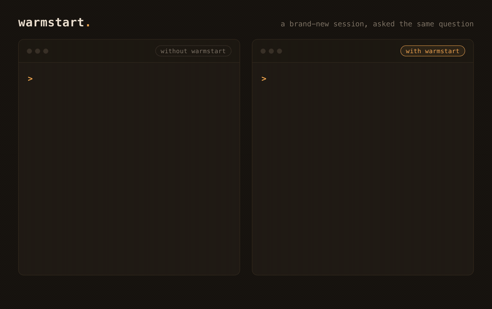

# warmstart

[](https://github.com/thiagoamaro91/warmstart/actions/workflows/ci.yml)

**Warm starts for Claude Code. Every session begins where the last one ended.**



## The problem

Every Claude Code session starts as an amnesiac. You re-explain the project, re-state where you
were, and re-discover the blocker you already found last time. Compaction eats your context
mid-task, and ending a session throws its state away.

## The idea

> No database. No embeddings. No server. warmstart's memory is a few markdown files and a shell
> hook: you can read it, edit it, and `git diff` it.

Every adjacent project pipes session memory into a vector database or a search index. warmstart's
bet is that an agent's memory should be legible: state a human can audit and correct beats state
only the machine can query. That is the whole wager, and it is the hill this project stands on.

## What it is, and what it is not

It is for people who use Claude Code daily on real, multi-session work. It was extracted from a
live system used every day for months, not built as a demo.

It is not a memory database, not RAG, and not a framework. It is plain files plus hooks plus two
conventions. If you stop using it, your notes are still just markdown. And it does not compete with
auto-capture memory tools like claude-mem: those keep an automatic log of what happened, while
warmstart curates what matters now and writes it back at session end. Complementary layers, a log
and a dashboard. The fuller comparison is in [docs/the-pattern.md](docs/the-pattern.md).

## What it looks like

The whole story is three beats:

1. **Before.** A fresh session in a project. You ask "where were we?" and get a generic, amnesiac
   answer.
2. **Install and work.** You set up warmstart (the quickstart below), do a small piece of work, and
   say "wrap up". The context files update to record where you left off, and that state is committed.
3. **After.** A brand-new session, first message. The index auto-injects. You ask "where were we?"
   and Claude answers with the current state, the open blocker, and the next action, by name.

## How it works

Three moving parts:

1. **A session-start hook injects a one-page dashboard.** On the first message of a session,
   `context-keeper.sh` reads `context_index.md` into the conversation. Claude wakes up knowing the
   state of every workstream.
2. **Deep state lives in per-workstream files, loaded only when the topic comes up.** Just-in-time
   context instead of stuffing everything in up front. This is Anthropic's own published
   context-engineering guidance; [docs/philosophy.md](docs/philosophy.md) carries the citations.
3. **A wrapup command writes state back at session end.** What changed, what is blocked, what is
   next. The loop closes, and the next session starts warm.

The guard hooks make the conventions real: the environment enforces what the model would otherwise
forget. Full mechanism in [docs/the-pattern.md](docs/the-pattern.md).

## Quickstart

A warm start in about ten minutes. You need `jq` and `awk`, both standard on macOS and Linux. Two
ways in: the plugin (two commands, everything auto-wired) or by hand (you copy the files and own the
wiring). Both land on the same plain-markdown state.

### The plugin: two commands

In Claude Code, add this repo as a plugin marketplace and install it:

```
/plugin marketplace add thiagoamaro91/warmstart
/plugin install warmstart@warmstart
```

That auto-wires all four hooks (no `settings.json` to merge, no `chmod`) and registers the
`/warmstart:setup` and `/warmstart:wrapup` skills. Then bootstrap your workspace root:

```
/warmstart:setup
```

Setup writes `CLAUDE.md` and `context_index.md` from the templates, and never overwrites a file that
already exists (it prints merge guidance instead). Fill in the workstream table in `CLAUDE.md`,
replace the toy workstreams in `context_index.md`, and restart Claude Code. On the first message of
your next session the index is injected automatically; ask "where were we?" and it answers from the
dashboard.

**Scope.** A default install is user scope, so warmstart is available in every project. That is safe:
`context-keeper.sh` is a silent no-op in any project with no `context_index.md`, so projects that
never adopted warmstart are untouched. To confine it to one project instead, pick "Project scope" in
the prompt that `/plugin install` opens, or use the terminal form
`claude plugin install warmstart@warmstart --scope project`.

### By hand: own your hooks

Prefer to see exactly what lands where, or not use the plugin system at all? Wire the same machinery
yourself.

1. **Get the files.** Run this from your workspace root (the top of the directory you launch Claude
   Code in), so the `warmstart/` folder lands as a subfolder right there. Every command in the steps
   below is written relative to that root. Clone the repo, or, if you already have it locally, copy
   it into a `warmstart/` folder:

   ```
   git clone https://github.com/thiagoamaro91/warmstart.git warmstart
   # or, from a local copy:
   cp -r /path/to/warmstart-source warmstart
   ```

   Either way you end up with a `warmstart/` directory in your workspace root, containing `hooks/`
   and `templates/`.

2. **Set up your workspace root.** From the top of the directory you launch Claude Code in, create
   two files from the templates:

   ```
   cp warmstart/templates/CLAUDE.md.template  ./CLAUDE.md
   cp warmstart/templates/context_index.md    ./context_index.md
   ```

   Fill in the workstream table in `CLAUDE.md`, and replace the toy workstreams in
   `context_index.md` with your own. (If the directory you launch from is not your workspace root,
   set `WARMSTART_WORKSPACE_ROOT` to the root instead; otherwise the hook finds it by climbing to
   the outermost `CLAUDE.md`.)

3. **Install the hooks.**

   ```
   cp -r warmstart/hooks ./hooks
   chmod +x ./hooks/*.sh
   ```

4. **Wire them in.** The hooks run through your `.claude/settings.json`. If you do not have one
   yet, create it straight from the shipped snippet:

   ```
   mkdir -p .claude
   cp warmstart/hooks/settings-snippet.json .claude/settings.json
   ```

   If you already have a `.claude/settings.json`, add the snippet's `UserPromptSubmit` and
   `PreToolUse` entries into its `hooks` object by hand; the snippet is only a few lines. Every
   entry points at `$CLAUDE_PROJECT_DIR/hooks/<name>.sh`.

5. **Restart Claude Code.** On the first message of your next session, `context_index.md` is
   injected automatically. Ask "where were we?" and it answers from the dashboard.

Either way you now have the injector and the guard hooks. To close the loop, add the wrapup skill:
the plugin registers it as `/warmstart:wrapup`; a manual install copies `skills/wrapup/` and runs it
per its `SKILL.md`.

## The guard hooks

Four hooks ship. The one to try first is `block-destructive-bash.sh`: it blocks shell commands
that bypass the trash and can wipe uncommitted work, and it is tier 1 of the adoption ladder
below. The rest: `context-keeper.sh` injects your context (above), `guard-memory-size.sh` keeps a
`MEMORY.md` under the size Claude Code loads at startup, and `guard-context-index-size.sh` keeps
the index under the window the injector uses. Each hook's behavior, wiring, and its fail-open vs
fail-closed choice is in [hooks/README.md](hooks/README.md).

## Adoption ladder

You do not have to use all of it. The plugin installs the whole machinery in one step, but the value
arrives in rungs, and each rung is standalone. The tiers describe how deep you go, not what you
install.

- **Tier 1:** let one guard hook do its job, `block-destructive-bash.sh`. Immediate protection,
  nothing else required. (A by-hand install can even stop here and copy just that one hook.)
- **Tier 2:** keep `context_index.md` current so `context-keeper.sh` injects a real dashboard.
  Sessions start warm.
- **Tier 3:** run the full loop, writing state back with the wrapup skill, per-workstream files, and
  cross-cutting reading lists.

The full value lands for daily Claude Code users juggling two or more workstreams. If you run a
single project casually, you will probably live at tier 1, and that is by design: tier 1 is a real
win on its own, not a failed tier 3.

## Also in this marketplace: dispatch, runbooks, skill-tuner, autonomous, and workflows

This repo doubles as a plugin marketplace, and it ships five more independent plugins.

[dispatch](dispatch/README.md): where warmstart guards what a session remembers, dispatch guards
what one agent hands to another: a PreToolUse hook blocks subagent dispatches that are
under-briefed or don't pick a model, and a SessionStart hook injects the playbook it enforces.
Same thesis, different moment. Install it with `/plugin install dispatch@warmstart`.

[runbooks](runbooks/README.md): two pure-markdown procedure skills, forcing-questions
(adversarial "is this worth building" interrogation) and spec-diagram (specs that lead with a
Mermaid diagram). Skills as plain-text runbooks, readable in full before you run them. Install it
with `/plugin install runbooks@warmstart`.

[skill-tuner](skill-tuner/README.md): an evidence-driven improvement loop for your own skills and
hooks. You hand it an evidence file, it derives and verifies findings, then splits them into a safe
tier (wording-only changes, auto-applied) and a gated tier (anything that changes behavior, written
up for human review). Install it with `/plugin install skill-tuner@warmstart`.

[autonomous](autonomous/README.md): drive one task end to end heads-down, research grounding at the
front and adversarial review at the back, across code, decisions, documents, or strategy. Two
checkpoints, four produce-heads. Install it with `/plugin install autonomous@warmstart`.

[workflows](workflows/README.md): a fan-out-and-verify pattern for multi-agent review, with a
runnable example that spreads independent finders across dimensions and then has skeptic agents try
to refute each finding before it is reported. Install it with `/plugin install workflows@warmstart`.

The six plugins share nothing but the repo; take any subset.

## Docs

- [docs/philosophy.md](docs/philosophy.md): the methodology (context engineering) and its Anthropic
  citations.
- [docs/the-pattern.md](docs/the-pattern.md): how the tiering and the hook actually work, plus the
  common questions (why files, not a database; how it compares to memory tools; what it costs).
- [docs/glossary.md](docs/glossary.md): the vocabulary, in plain language.

## Status and origin

v0.2, extracted from a live personal system. It is a working subset, not a finished product: the
core loop (context injection, templates, guard hooks, a lite wrapup) is here and tested, and it now
installs as a Claude Code plugin in two commands.

Roadmap tease, one line: the next version brings the full wrapup pipeline and advanced guard hooks;
further out, autonomy earned through the same state files.

## License

MIT. See [LICENSE](LICENSE).
